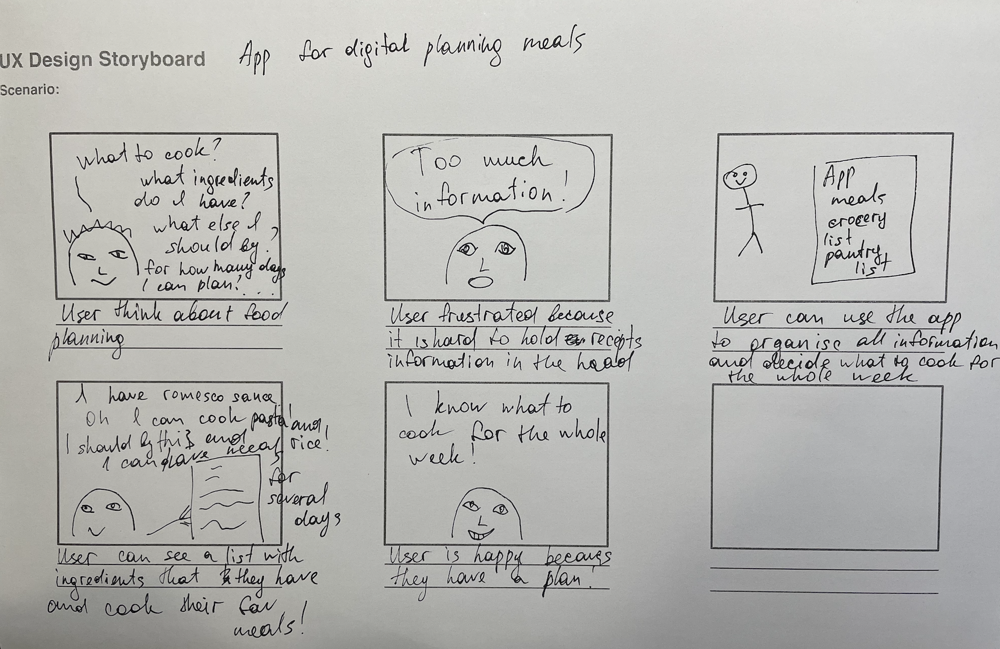
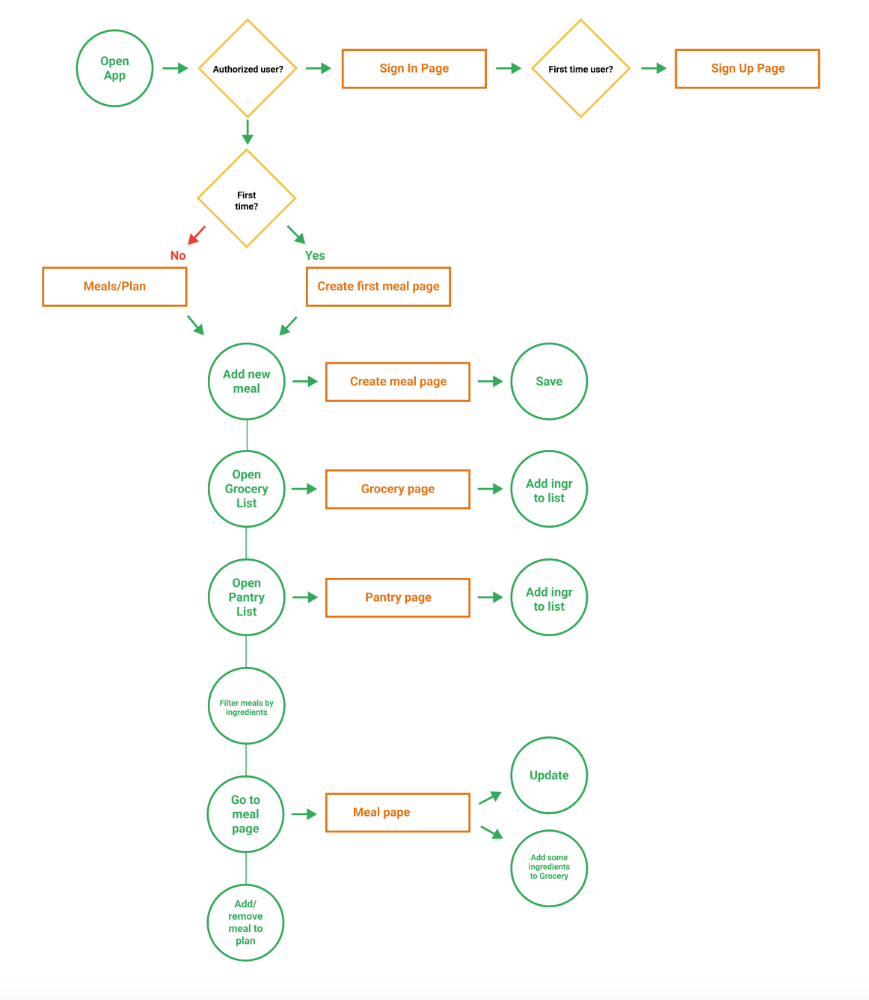
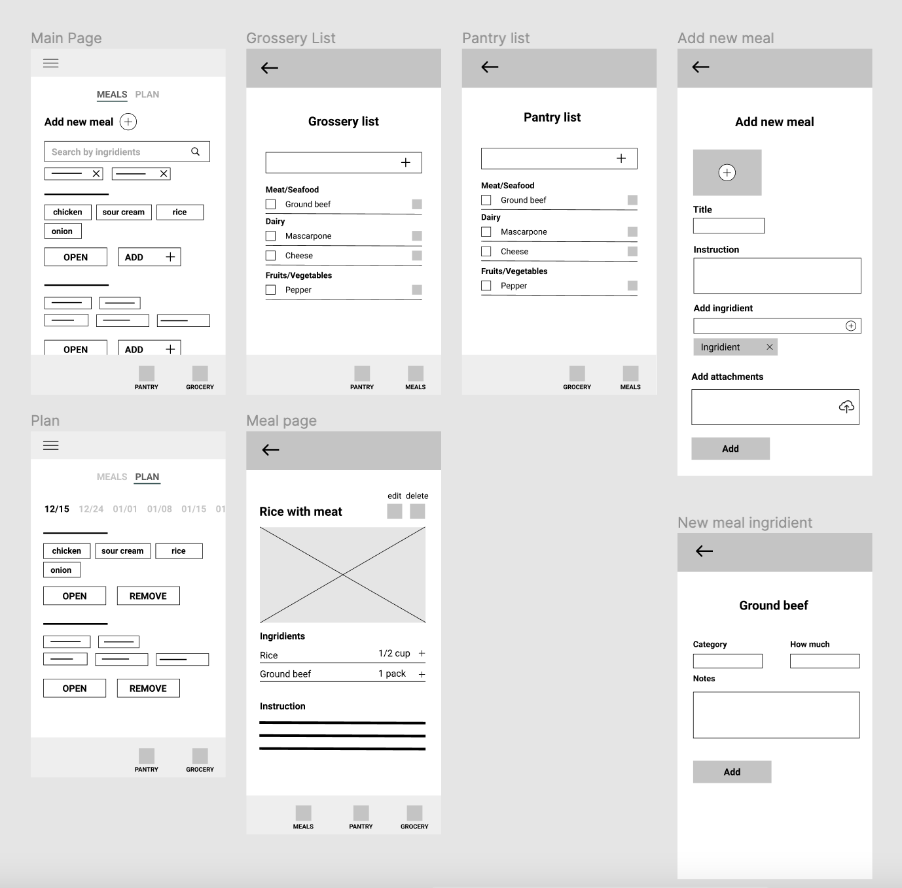
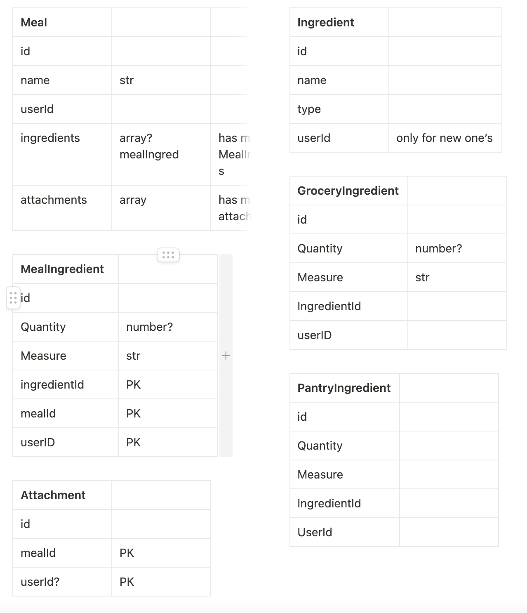

# Meals Planner (prototype)

The App helps to plan meals for several days.
You can already create new meals, search them by ingredients, and put some meals into the plan!  
The App doesn't have a backend yet. The data is stored on the local storage.  
It is developing App in the early stage and it is prototyping for mobile screens for now.  
In the future, I plan to develop grocery list and pantry list pages to better understand what product do you need to buy for a week.

## Demo

https://alekseevaiana.github.io/meals_planner/

### You can use it like a mobile App

#### IOS

- Open Safari on your iPhone
- Navigate to the https://alekseevaiana.github.io/meals_planner/
- Tap the Share icon (the square with an arrow pointing out of it) at the bottom of the screen
- Scroll down to the list of actions and tap Add to Home Screen. (If you don't see the action, scroll to the bottom and tap Edit Actions, then tap Add next to the Add to Home Screen action. After that, you'll be able to select it from the Share Sheet.)

#### Android

- Open Chrome
- Navigate to the https://alekseevaiana.github.io/meals_planner/
- Tap the menu icon (3 dots in upper right-hand corner) and tap Add to homescreen.
- Choose a name for the website shortcut, then Chrome will add it to your home screen.

## Main Scripts

### `npm start`

Runs the app in the development mode.\
Open [http://localhost:3000](http://localhost:3000) to view it in your browser.

The page will reload when you make changes.\
You may also see any lint errors in the console.

### `npm test`

Launches the test runner in the interactive watch mode.\
See the section about [running tests](https://facebook.github.io/create-react-app/docs/running-tests) for more information.

### Deployment

### `npm run deploy`

## Style Guide

In the project I use MUI Library  
[https://mui.com/components/material-icons/?theme=Rounded](https://mui.com/components/material-icons/?theme=Rounded)

## About the project development

### Story behind

The idea of a project came to me when I was trying to organize the recipes, that I cook every day. But I didn’t find a solution to make it clean using tools, that we already have. So, I decided to create my own app that helps not only me but maybe some other people. I talked to my friends, who manage cooking, and I figured out that almost everybody has the same problems as me. In my head I could build an app very simple, I knew what to do, but when I started to draw my first wireframes, I met a challenge. I just didn’t know where to start, and how can I make everything right. At this time I wanted to learn more about design, and I found Google UX Course on Coursera and started it. Everything that I learned there could help me to build my own projects. After a long time of planning, I coded the prototype, tested it with real users, and did a lot of very useful mistakes. Down there you can see my thinking and planning journey more closely.
The project is in active development, right now I am finding a way to make it look better, and then I am going to code it.

### Problem

- I don’t have a perfect place to store all my recipes, which I already know how to cook
- When I store somewhere too many recipes, it is challenging to find recipes by ingredients
- I buy food but don’t use it completely, because ingredients often go only to one particular recipe
- I buy a long term food (souces, conserves) and don’t use them
- I want to eat homemade meals but don’t have too much time to plan them and do grocery shopping too often
- I don’t want to cook complex meals from recipes apps

My storyboard:

## Challenge

- Create an app where you can create all your meals, search them by ingredients, and put some meals for the plan
- This app should have a Grocery list (to know what to buy) and a Pantry list (to know what you already have)

## Research

I was looking for apps, that already exist and could solve my problem. What I found:

- a lot of apps with grocery shopping lists and even pantry lists, some of them are great, but no opportunity to create meals from there
- there are some apps with meals planning, but they take recipes from API and I can’t create my own recipes
- a lot of apps with just recipes

## Site Map

Here is my Site Map that I created before starting drawing wireframes.

## Wireframes

Then I draw wireframes in Figma.
It looked something like this.

## Prototype and User Testing

Then I coded prototype, just to give it a try. I user localhost for data storage.
When I finished basic features, I tried app on my own and asked few users tell me about their experience and thoughts.
What I found out:

User 1

_For a prototype:_

- They need Instructions for a new user
- They need more meaningful description for every page and buttons

_Was difficulties with:_

- Couldn’t find “add new meal button”, was searching for a long period of time.

User 2

_For a prototype:_

- Wanted oportunity to add groceries from plan and from meal page
- Noticed that measures are missing, and this is a very important feature

My next step is creating a hight fidelity design, build backend and frontend.
I already created data models for backend:

For my purposes I desided to use AWS Amplify Studio. I didn't use this tool before, so I practiced it with small basic application. It handles authentication, data storage, it has GraphQl and more features for backend.

I started to draw mockups, but have to learn more about UI first. So this is a next challenge! After I create UI, and build backend I finelly can build the whole app.
